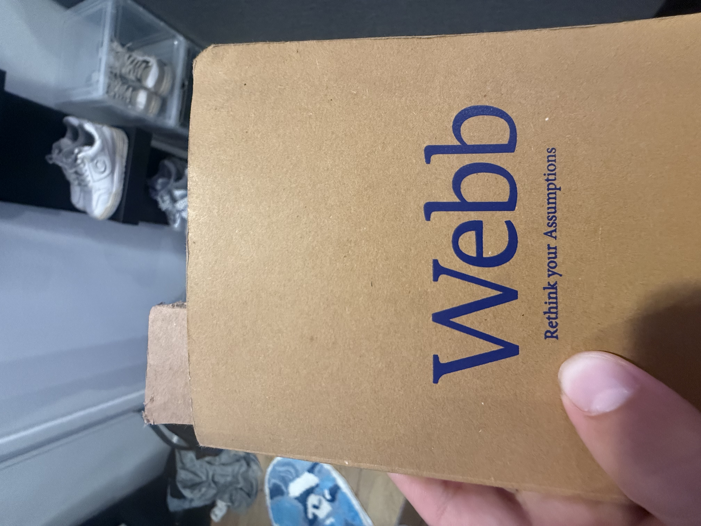
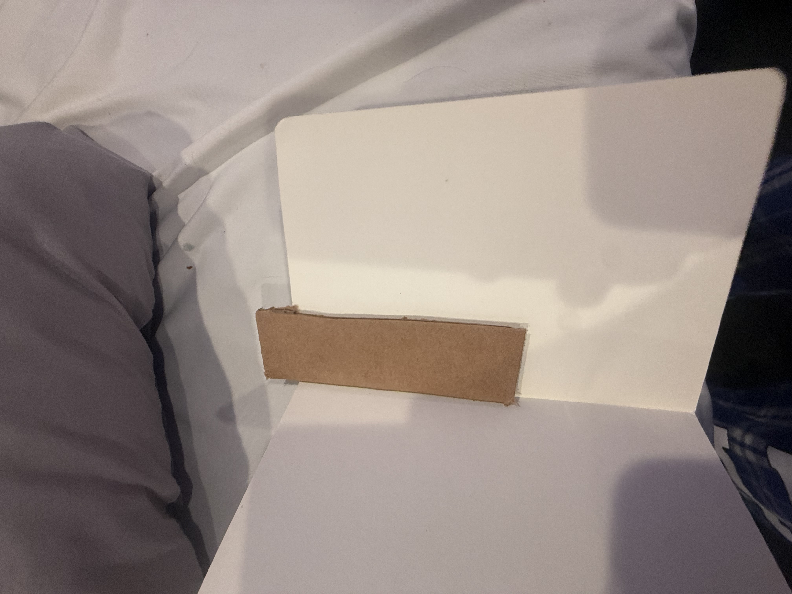
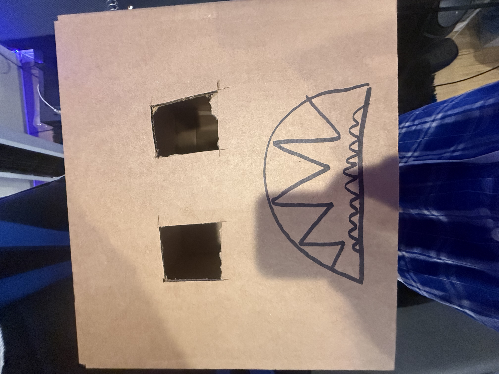
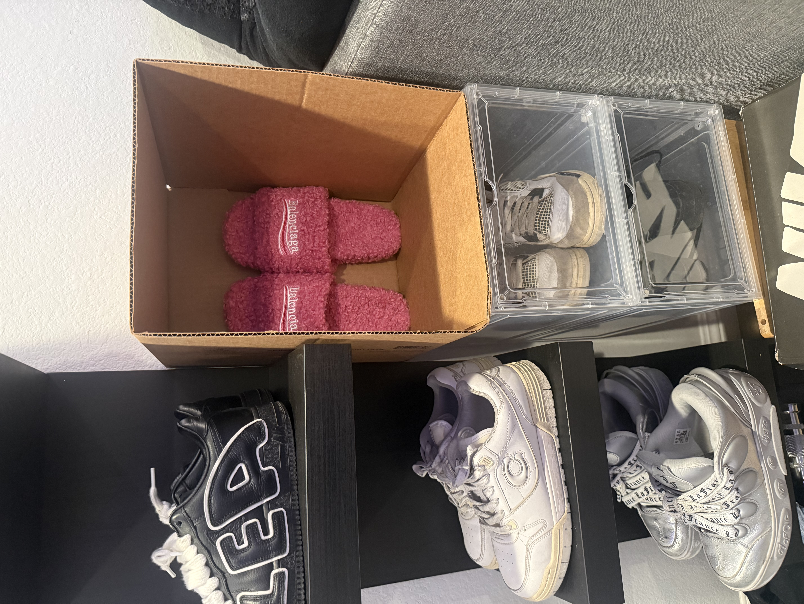
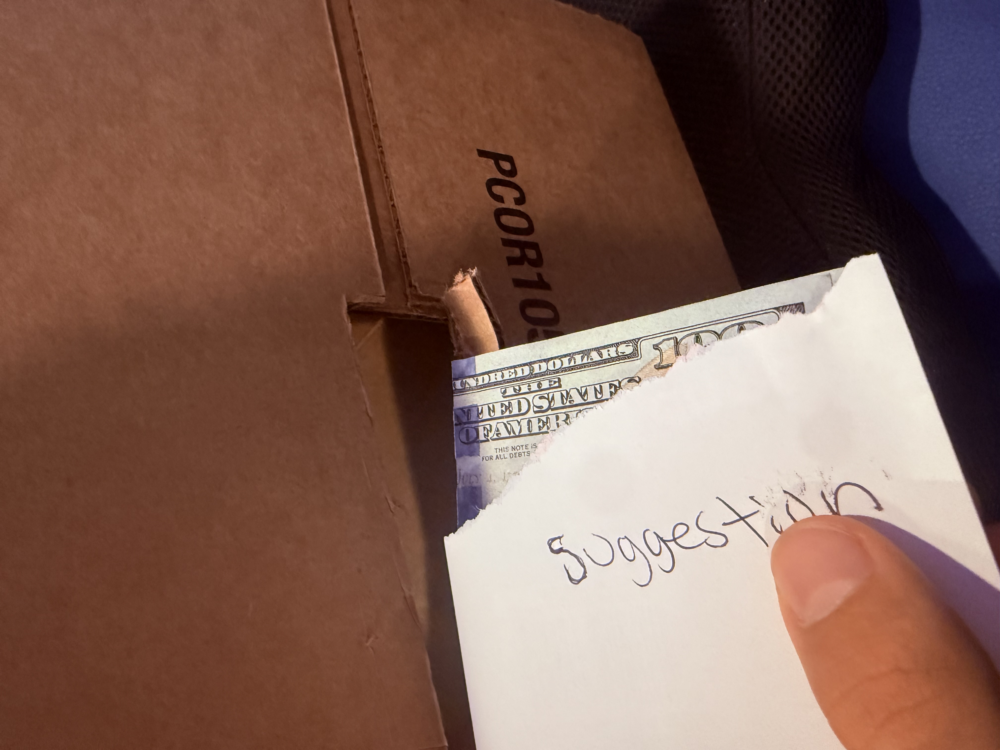

# Thinking outside the box activity

Look what I made out of cardboard!

This is a bookmark made out of cardboard. Very handy. It was designed for my mom so she can stop folding the pages to know where she left off.

This is a mask made out of cardboard. It was designed for my brother

This is a shoe box display. I like displaying my shoes in my room. You can also use it as a shoe storage bin!

This is a suggestion/donation box made out of cardboard. You can put money in there for donations, or put little notes for suggestions or anything else. 
